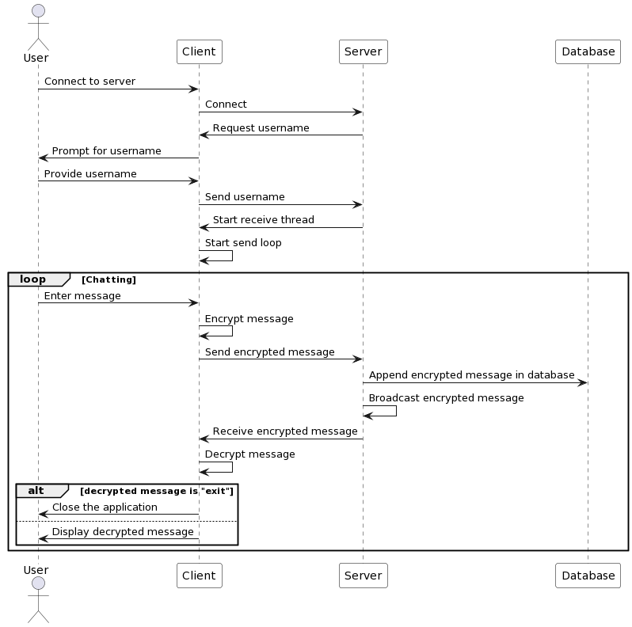

# Security-and-Ethics-for-Data

# Chat Application

This is a simple chat application implemented in Python using sockets and AES encryption. The application consists of a server and multiple clients that can connect to the server to participate in a chat.

## Demo

This is a short video shows the demontration of the project:
https://drive.google.com/file/d/1DEzvhPZ-4ItfgUca6qDKixtVWY2LwWG5/view?usp=sharing

## Project structure

The project is generally structured as follows:
```
root/
├─ server.py
├─ client.py
├─ usercase.png
├─ README.md
├─ 2023-05-20.txt
```
The text file is a sample of the chat history that will be save by the server.

## Server

The server is responsible for accepting client connections, handling incoming messages, and broadcasting messages to all connected clients along with store the chat history and save it in a text file (Data bases were not implemented here). The server uses AES encryption to secure the communication between clients.

### Dependencies

The server requires the following dependencies:
- `socket`: provides low-level network communication.
- `threading`: allows concurrent execution of code.
- `Cryptodome`: a Python library that provides cryptographic functions.

### Usage

To start the server, run the `server.py` script. The server listens on a specific host and port for incoming connections. By default, it listens on `localhost:8000`. The chat will also be display in the server side just for visualization purpose (the chat is display in the server as a decrypted message).

Once the server is running, clients can connect to it using the `client.py` script.

Once you run as a client, the application will ask you to enter your name and after that you will be able to chat.

## Client

The client is responsible for connecting to the chat server, sending and receiving messages. Each client can enter a username and participate in the chat. The client also uses AES encryption to secure the communication.

### Usage

To connect to the chat server, run the `client.py` script. The client prompts for a username and connects to the server using the specified host and port. By default, it connects to `localhost:8000`.

Once connected, the client can send messages by typing them in the console. To exit the chat, type "exit" in the console.

## Chat History

The server keeps track of the chat history and sends it to new clients when they connect. Each client receives the chat history upon connection, allowing them to see previous messages.

The server also logs the chat history to a log file. Each message is appended to the log file along with a timestamp as the file name.

## Diagram

Below is the sequence diagram that show how does the component interact with each other:


## Flaws

There are still many flaws in my application. The exit functionality is working but it still not work as demand. The application also only been use in the same system not through multiple computers so there will need to be more improvement.

---

Please note that this is a basic implementation and does not include features such as user authentication or message persistence. It serves as a starting point for building a more robust chat application.
